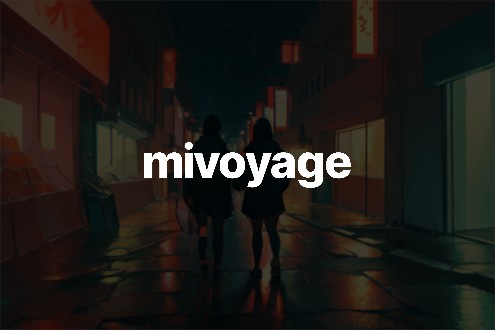

# mivoyage

A discord bot to generate AI images using [stablediffusion-api](https://github.com/qtrrb/stablediffusion-api)



## Roadmap

> **Warning** This project is currently out of date.

- [ ] Upscaling
- [x] ~~Image to Image~~
- [x] ~~Aspect ratios~~
- [x] ~~Loading different models~~
- [x] ~~Text to Image~~

## Usage

- Clone this repository

```bash
git clone https://github.com/qtrrb/mivoyage
```

- Install necessary dependencies

```bash
npm i
```

- Run the project with

```bash
npm run dev
```

or

```bash
npm run build
npm run serve
```
